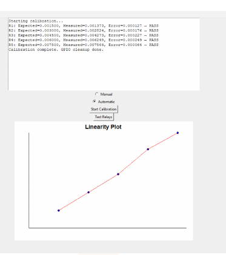

# Automated Shunt Calibration System (Raspberry Pi)

Built during a research internship at **ISRO, Satish Dhawan Space Centre (SHAR)**, Sriharikota (Jul–Aug 2025).
Guided by Rohith Bala M. (SC) and Naveen Kumar G. (SD), with support from Ananda Raj J. (SG).

Shunt calibration simulates a known strain on a Wheatstone-bridge sensor by switching a precision resistor across one bridge arm. This system automates the manual procedure. A **Raspberry Pi** switches the shunts through relays, reads the bridge output on an **ADS1015 ADC over I²C**, compares it with the bridge model, and logs and plots every result from a **Tkinter GUI**.



## How it works
```
Raspberry Pi ──GPIO──► 5-ch relay bank ──► precision shunt across one 350 Ω arm
     ▲                                             │
     └──── I²C ◄── ADS1015 (AIN0−AIN1) ◄── bridge output (V+, V−)
```
For each shunt R1–R5:
1. Activate its relay (only one shunt on at a time).
2. Wait for the settling delay.
3. Read the bridge voltage from the ADC, or take an operator entry in manual mode.
4. Compute the expected output for a quarter bridge with a shunted arm:
   `V_exp = (Vexc / 2) · Rg / (2·Rs + Rg)`
5. Compute the error `|V_meas − V_exp|` and mark PASS/FAIL against the tolerance.
6. Log the result to CSV and update the linearity plot.

## Shunt set (Vexc = 10 V, Rg = 350 Ω)

| Shunt | Rs (kΩ) | Simulated output | GPIO (BCM) |
|---|---|---|---|
| R1 | 582.98 | 0.15 mV/V | 17 |
| R2 | 291.32 | 0.30 mV/V | 18 |
| R3 | 194.09 | 0.45 mV/V | 27 |
| R4 | 145.48 | 0.60 mV/V | 22 |
| R5 | 116.32 | 0.75 mV/V | 23 |

## Example calibration run (from the internship report)

| Shunt | Expected (V) | Measured (V) | Error (V) | Result |
|---|---|---|---|---|
| R1 | 0.001500 | 0.001373 | 0.000127 | PASS |
| R2 | 0.003000 | 0.002824 | 0.000176 | PASS |
| R3 | 0.004500 | 0.004273 | 0.000227 | PASS |
| R4 | 0.006000 | 0.006249 | 0.000249 | PASS |
| R5 | 0.007500 | 0.007564 | 0.000064 | PASS |

Tolerance: 0.5 mV. The report lists the nominal expected values (0.15 mV/V steps). The code computes the exact value from each resistor, so its expected voltages differ by at most 11 µV. All five shunts still pass.

## Software structure
```
gui.py                       Tkinter GUI (entry point): Manual/Automatic modes, Test Relays, live linearity plot
main.py                      Calibration engine; talks to the GUI only through gui_callback(action, ...)
config/config.json           Vexc, Rg, shunt values, tolerance, use_adc, ADC range, settle delay
hardware/shunt_controller.py Relay control through RPi.GPIO (one shunt active at a time)
hardware/adc_reader.py       ADS1015 I²C driver (differential AIN0−AIN1, configurable PGA range)
hardware/gpio_stub.py        No-op GPIO so the software runs on a PC
model/bridge_model.py        Expected bridge output
model/comparator.py          Error and PASS/FAIL
logger/logger.py             CSV logging
```
Because the engine reports to the GUI only through `gui_callback`, it is decoupled from Tkinter and could be driven from a CLI or network service instead.

## How to implement

**1. Wire the hardware**
- **Relays:** relay IN1–IN5 → GPIO 17, 18, 27, 22, 23 (BCM). Relay VCC → 5 V, GND → GND. Each relay switches its shunt resistor across one 350 Ω arm of the bridge.
- **ADC:** ADS1015 VDD → 3.3 V, GND → GND, SDA → GPIO 2, SCL → GPIO 3, ADDR → GND (address 0x48).
- **Bridge:** excitation (10 V) across the bridge, then bridge output V+ → AIN0 and V− → AIN1.
- Make the ADS1015 ground common with the bridge supply ground.

**2. Set up the Raspberry Pi**
```bash
sudo raspi-config            # Interface Options → I2C → Enable, then reboot
sudo apt install python3-tk python3-smbus i2c-tools
i2cdetect -y 1               # the ADS1015 should appear at 0x48
git clone https://github.com/Vipul-9/isro-shunt-calibration.git
cd isro-shunt-calibration
```

**3. Configure** `config/config.json`
- Set `Vexc`, `Rg` and the measured values of your shunts in `Rs`.
- Set `tolerance` (V), `adc_fsr` (ADS1015 range: 2.048 V suits millivolt bridge outputs) and `settle_delay` (s).

**4. Run**
```bash
python3 gui.py
```
- **Test Relays** clicks each relay in turn, so you can check the wiring.
- **Automatic** steps through R1–R5 in order.
- **Manual** asks which shunt to switch in next, so you can repeat or skip shunts.
- In both modes the reading comes from the ADC when `"use_adc": true`. With `false`, you type it in, e.g. from a DMM.
- Enter a file name when asked. Results go to `<name>.csv` and the linearity plot to `<name>.ps`.

**Running on a PC (no hardware)**
Set `"use_adc": false` in `config/config.json`, then run `python3 gui.py`. A stub replaces the GPIO and you type the measured voltages in.

**Troubleshooting**
- *ADC not found:* I²C isn't enabled, or SDA/SCL are swapped. Check with `i2cdetect -y 1`.
- *Readings near 0:* check that AIN0/AIN1 are on the bridge output, not the excitation.
- *All shunts FAIL by a similar amount:* check `Vexc` in the config against the actual excitation voltage.

## Hardware
- Raspberry Pi 4 Model B
- 5 V opto-isolated relay module
- ADS1015 12-bit I²C ADC
- 0.1 % precision shunt resistors
- 350 Ω bridge

## Contributing
I'm open to open-source contributions and collaboration. Issues and pull requests are welcome.
You can reach me at **vipulatluri98@gmail.com**.
